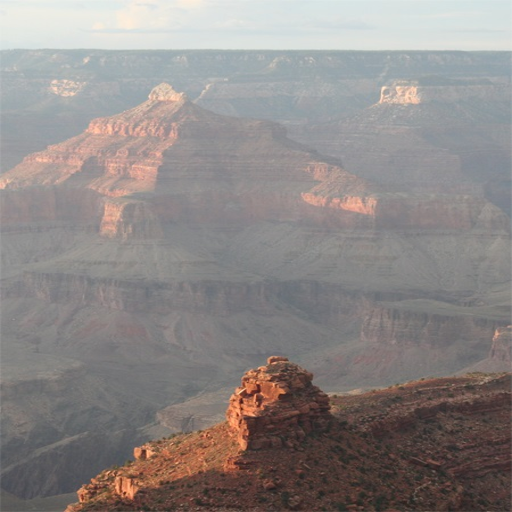
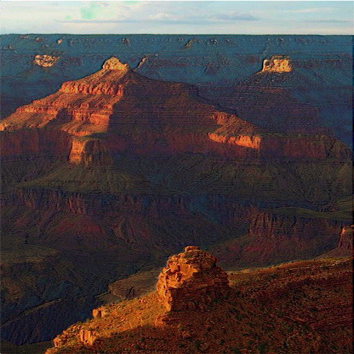
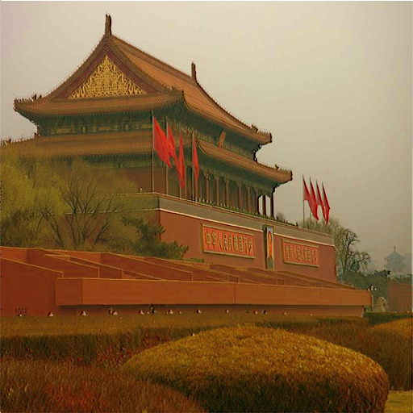
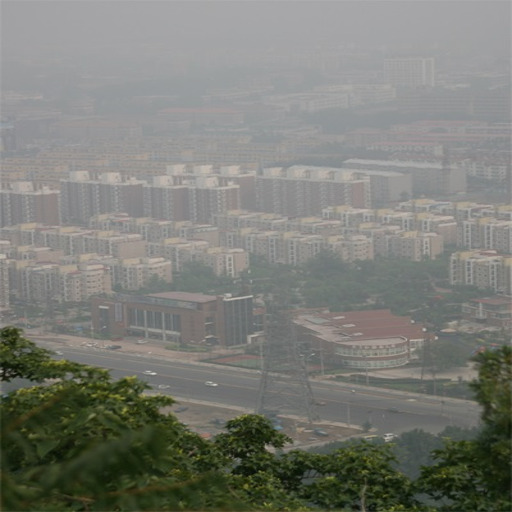
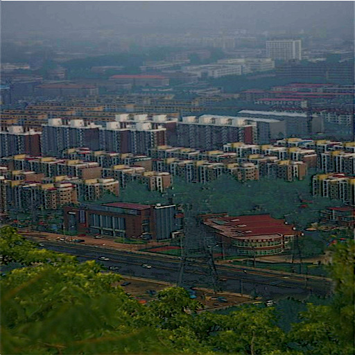

# 🌫️ Real-Time Accelerated Image Dehazing Using FPGA

  

##  Overview

This project presents a hardware-accelerated, real-time image dehazing pipeline, fully implemented in Verilog and synthesized on a Xilinx ZedBoard FPGA (Zynq-7000). The goal is to achieve high-performance image dehazing using a custom pipelined architecture based on the Dark Channel Prior and Scene Radiance Recovery methods, optimized for fixed-point arithmetic and stream-based throughput. 

 The pipeline receives BMP images via UART, processes them to remove haze, and returns the reconstructed haze-free image back to the host PC.


---
##  Motivation

  Hazy or foggy images reduce visibility and impair the performance of vision-based systems in applications such as:
- Autonomous driving 
- Aerial and satellite imaging 
- Surveillance systems 
- Remote sensing in adverse weather conditions 
  
  Real-time haze removal is computationally expensive on general-purpose CPUs. To address this, the design uses a custom FPGA-based hardware accelerator to:
- Achieve parallelism
- Support stream-based pipelining
- Enable real-time dehazing on-chip
- Reduce latency compared to software solutions
  
---

##  Objectives

-  **Accelerate DCP-based dehazing** using FPGA for real-time performance.
-  **Modular Verilog Implementation** of each processing stage: dark channel, atmospheric light, transmission map, and restoration.
-  **Optimize for low-latency and energy efficiency** using pipelining and parallelism.
-  Integrate with high-level tools like **MATLAB (HDL Coder)** and **Python** for simulation and visualization.
-  Enable **deployment on embedded platforms** (Zynq SoC) with **AXI-stream interface**.

---

##  Key Features

| Module | Description |
|--------|-------------|
| `Register Bank` | Sliding 3×3 window buffer for streaming pixel input. |
| `Dark Channel` | Min-channel computation for haze region localization. |
| `Atmospheric Light` | Brightest pixel estimation from dark channel. |
| `Transmission Map` | Light transmission modeling using physics-based equations. |
| `Image Restoration` | Reconstructs haze-free image using physical haze model. |

---

##  Algorithm Overview

This project is inspired by the IEEE TCSVT paper:
"Hardware Implementation of a Fast and Efficient Haze Removal Method"

Yeu-Horng Shiau, Hung-Yu Yang, Pei-Yin Chen, Member, IEEE, and Ya-Zhu Chuang

Key Steps:
1.Atmospheric Light Estimation
2.Transmission Estimation
3.Scene Radiance Recovery

---
## Hardware Architecture
  The complete hardware pipeline is organized into modular Verilog blocks as follows:

### 1. WindowGenerator
- Extracts 3×3 RGB window using 4 line buffers
- Outputs 9 pixels (in1 to in9) in parallel
- Used in both ALE and TE stages
- Easily scalable to generate larger windows
### 2. ALE (Atmospheric Light Estimation)
- Computes per-pixel minimum(R, G, B)
- Performs 3×3 spatial minimum using comparator trees
- Computes the dark channel per 3x3 RGB window
- Selects brightest pixel from the dark channel of the frame
- Calculates inverse atmospheric light for TE stage
- Fully pipelined and stream-compatible
### 3. TE (Transmission Estimation)
- Estimates pixel-wise haze using:
- t(x) = 1 - ω * min(R, G, B) / A
- ω = 0.9375 is implemented as a constant
- All operations use Q0.16 fixed-point arithmetic
### 4. SRSC (Scene Radiance and Scaling Correction)
- Computes:
   J(x) = (I(x) - A) / max(t(x), t₀) + A
- Handles division using reciprocal lookup
- Ensures t(x) ≥ t₀ = 0.25 (Q0.16)
- Produces dehazed RGB output
### 5. TE_and_SRSC
- 8-stage pipelined core combining TE and SRSC
- Improves throughput by eliminating intermediate buffering
- Maintains valid signal propagation across pipeline

---

### Top-Level Design
  #### Pipeline Flow
    WindowGenerator → DarkChannel → ALE → TE_and_SRSC
  #### Interface
  - Input: RGB pixel stream from UART
  - Output: Dehazed RGB pixel stream
  #### Features:
  - Valid signal-based flow control
  - Modular and synthesizable design
  - Fully stream-based datapath

---

### Testbench (Top_TB)

- Reads BMP file (input.bmp) and extracts pixel data
- Drives the dehazing pipeline and captures results
- Writes output to BMP file (output.bmp)
- Parses BMP header and maintains padding
- Simulates full system operation with $fread / $fwrite

---

## Features

- 3×3 sliding window for local filtering
- Dark channel estimation with comparator trees
- Fixed-point division and multiplication
- Transmission floor control (t₀ = 0.25)
- Fully pipelined 10-stage datapath
- Synthesizable on ZedBoard FPGA
- Modular, reusable Verilog architecture
- Verified using waveform simulations and output BMP comparison

---

## Fixed-Point Arithmetic

- Format: Q0.16 (16-bit signed/unsigned)
- Division:
   recip_t = 2^16 / t
- Arithmetic Units: Signed adders, clamping logic, LUT-based reciprocal

---

## Testing and Simulation

- Tools Used: Vivado Simulator, MATLAB, Pycharm
- BMP I/O:
    - Header parsed and preserved
    - Input and output streams verified
- Verification:
    - Waveform analysis
    - Visual output inspection
    - Pixel-wise comparison

---

## UART Communication on ZedBoard

 #### Implementation:
 - Custom serial protocol over UART
 - Image streamed pixel-wise (RGB) from host to FPGA
 - Processed dehazed image returned via UART
 
---
##  Results

### IP


### Block Diagram


### Utilization


###  Example Results

| Original Image | Dehazed Output |
|----------------|----------------|
|  |  |
|  |  |
|  |  |

*Test images were streamed via AXI interface and processed in real time on Zynq FPGA.*


---

## 🛠️ Tools & Technologies

-  **Xilinx Vivado 2023.2** – RTL Design, Synthesis , Simulation, Implementation
-  **ZedBoard FPGA (Zynq-7000)**
-  **Python(Custom Python tools for image analysis)** – Pre/post-processing and                    visualization support
-  **MATLAB + HDL Coder** – Algorithm simulation, RTL generation
-  **Xilinx Vitis HLS** – Software integration, AXI Stream interface, deployment

---

##  Repository Structure

**Image_Dehazing_Using-FPGA**
```bash
├── ip codes/            # ip codes of top modules to generate IP
├── MATLAB/              # MATLAB scripts and testbench
├── Python/              # Python utilities for image testing
├── Vitis/               # software application code for deploying on FPGA
├── Vivado/              # Complete RTL modules for each dehazing block,HDL hierarchy and IP-wrapped top modules
├── LICENSE              # MIT License
└── README.md            # You're reading it!
```

##  Future Work
- Optimize fixed-point dynamic range
- Add gamma correction and contrast enhancement
- Real-time camera input
- Video Processing

---

##  References
- **He, Kaiming, Jian Sun, and Xiaoou Tang.**  
  *"Single Image Haze Removal Using Dark Channel Prior."*  
  *IEEE Transactions on Pattern Analysis and Machine Intelligence (TPAMI), 2011.*

- **IEEE TCSVT Paper**
  *"Hardware Implementation of a Fast and Efficient Haze Removal Method"*  
  *Yeu-Horng Shiau, Hung-Yu Yang, Pei-Yin Chen, Member, IEEE, and Ya-Zhu Chuang*
  
- **Image Processing on Zynq.**                                                        
  *Vipin Kizheppatt - [Vipin-video](https://www.youtube.com/@Vipinkmenon)*

- **FPGA Image Processing.**
  *Udemy Course by Hui Hu*


---

## License
- **BSD 3-Clause License**
    - *You are free to fork, contribute, and build upon this project under the terms of the [BSD 3-Clause License](https://opensource.org/licenses/BSD-3-Clause).*

---

## ABOUT
- **Hardware Accelerator Design | February–July 2025**
     - *Designed a complete image dehazing pipeline based on the Dark Channel Prior algorithm using pipelined Verilog modules, optimized for fixed-point hardware on FPGA.*

---

##  Author

- **Yennam Sai Tharun Reddy**
   - *(Dept. of ECE, Vasavi College of Engineering)*

---

##  Keywords

`FPGA` • `Real-Time Processing` • `Image Dehazing` • `Computer Vision` • `Dark Channel Prior` • `Verilog HDL` • `Embedded Vision` • `Zynq SoC` • `Hardware Acceleration` • `Vivado` • `Vitis` • `AXI Stream` • `Autonomous Systems`

---

> ✨ *If you found this work interesting, consider starring 🌟 this repo or connecting with the authors on LinkedIn!*
